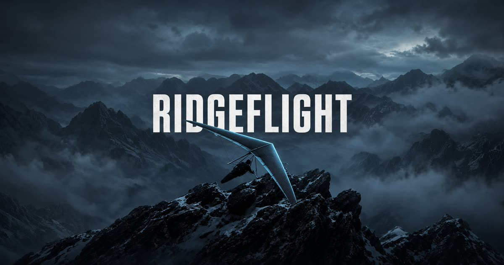

# Ridgeflight

A low-poly 3D aerial scout. Fly a hover-craft over a faceted island chain with mouse-look, keyboard thrust, ground collision, and a height-colored terrain mesh.



## Fly

- **Mouse** — look (click to lock pointer; drag on touch)
- **W / S** — thrust / brake
- **A / D** — yaw left / right
- **Space / Shift** — climb / descend
- **F** — wireframe
- **N** — day / night
- **Esc** — pause

The hull will not pass through the ground. On a phone, the left stick is thrust/yaw and the chevrons climb or descend.

## Stack

React 19, TanStack Start, Three.js, React Three Fiber, Tailwind v4.

## Run

```bash
npm install
npm run dev
```

Open the printed local URL. Production build:

```bash
npm run build
npm run preview
```

## License

Source in this repository is provided as-is for the Ridgeflight demo.
